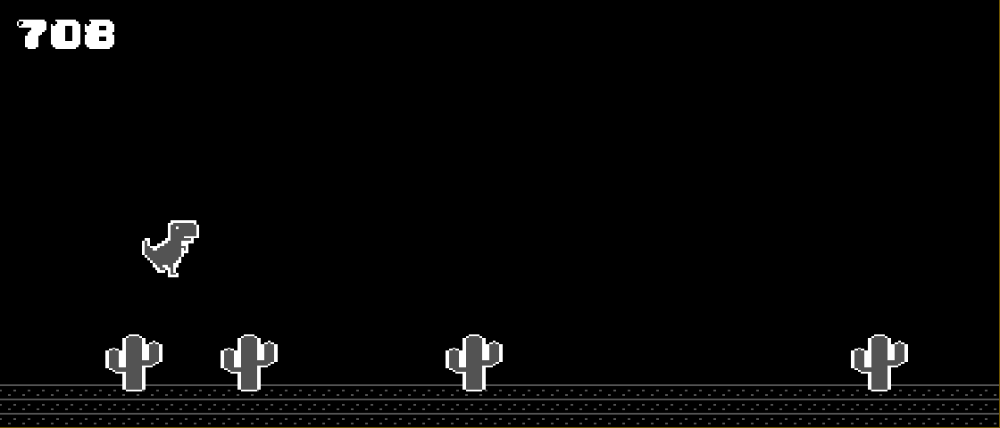

# Introduction

That's a rush project in group of 3 people. We had to make a 2D in 48 hours while **discovering** SDL.

We had **big plans**: TowerFall Ascension like video game with local and online multiplayer mode, with some basic AIs mobs:


But of course, it ended up being a **T-Rex Run!** like video game.



I don't know if that's funny or sad.

# How to play the game :

- Follow instructions on menu to launch game

Playing keys :
    - 'Esc' : switch on option menu while playing
    - 'Space' : jump

*You will notice the astronomical amount of game options.*

# Compilation :

The compilation is done using "make", for now there are 3 rules available :

- all   : Compile the project, building the binary "myfind"

- run : Launch the game
        If the game is not build yet, it builds it.

- clean : Remove all files created by other rules

```
[OK] Game menu
    [OK] Displaying menu choices
    [OK] Event handler
        [OK] Ability to switch on menus
        [OK] Correctly handle game quit
[OK] Game Manager
    [OK] Basic definition
    [OK] Game loop
        [OK] Default behaviour (do nothing)
        [OK] Ability to get back to the menu
            [OK] ability to switch on pause menu
            [OK] ability to stop the game and get back to menu
[OK] Physics
    [OK] Jump
    [OK] Slice
    [OK] Update physics on all map elem
[OK] Music
    [OK] On action
    [KO] Background music
```

# Authors :

Yassir Ramdani, Zachary Fakir, Sami Issaadi
